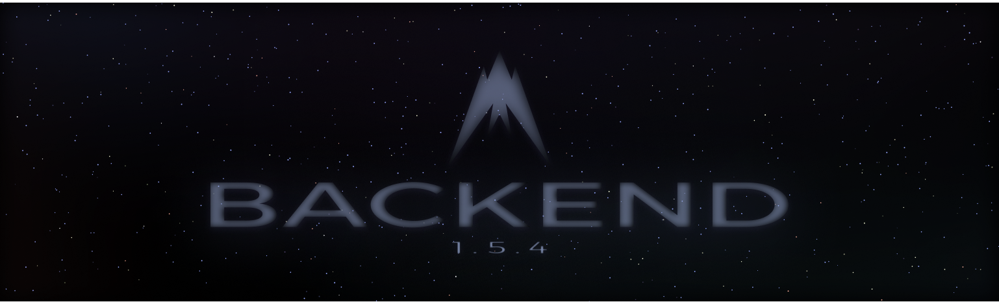

# Albatross Backend 1.5.3

this backend repository maintains Albatross' Theme variables and website(soon).

**Note: Palettes still being tinkered on.**

## Table of contents
- [Albatross Backend 1.5.3](#albatross-backend-153)
  - [Table of contents](#table-of-contents)
  - [Backend theme Features](#backend-theme-features)
  - [Changelog](#changelog)
    - [Albatross Backend 1.5.3](#albatross-backend-153-1)
      - [Added](#added)
      - [Removed](#removed)
    - [Albatross Backend 1.4.2](#albatross-backend-142)
      - [Added](#added-1)
      - [Fixed](#fixed)
  - [License](#license)

## Backend theme Features
- multiple customizable palettes
- partial light mode support
- discord variable replacement
- font replacement
- added variables for development
- added icons for development

## Changelog
All past changes to this project will be documented in the [changelog](/changelog.md) page.

### Albatross Backend 1.5.3
Mica blur compatibility update

#### Added
- Added Acrylic Palette
- Added alpha/opacity variables for window transparency compatibility through all themes.

#### Removed
- Removed unnecessary variables for performance.

### Albatross Backend 1.4.2 
Major backend overhaul, all palettes now support both light and dark mode brings more possibilities to what you can create.

#### Added
- Added simultaneous support for light and dark mode. (Ash and midnight theme will be released in future updates)

#### Fixed
- Fixed variables not automatically overriding in discord.
- Fixed saturation factor bugs

Spot a bug? Please go to our [issues](/issues) page, to have it resolved quickly.

## License

This project is under the **[GNU General Public License v3.0](https://spdx.org/licenses/GPL-3.0-or-later.html)**. Please refer to the [License](license) for further information regarding the license' permissions, limitations and conditions.

 
 

Made with ♥️ by [Albatross Creative](https://github.com/albatrosscreative)

